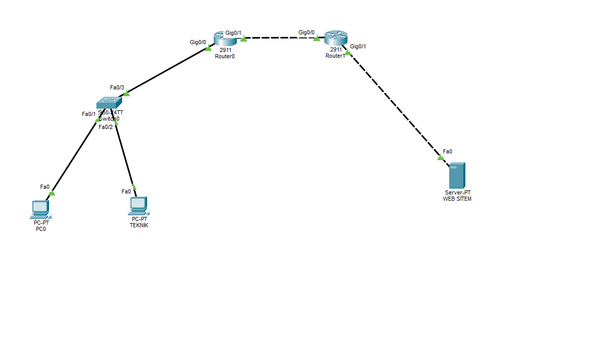

# Cisco-Packet-Tracer-Lab
Cisco Packet Tracer ve ağ teknolojileri üzerine geliştirdiğim tüm topolojiler, yapılandırma notları ve uygulama projelerimin arşivi.

----

## 📁 Laboratuvar Projeleri

### 🟢 01. DNS, Web Server & SSH Security Lab

#### 🖼️ Ağ Topolojisi


#### 🎯 Proje Bileşenleri & Özeti
- **Ağ Mimarisi & Yönlendirme:** İstemciler (`PC0`, `PC TEKNİK`) Switch0 üzerinden ağa bağlıdır. Router0 ve Router1 cihazları arasında IP yönlendirmesi yapılmıştır.
- **Sunucu Hizmetleri:** `Server-PT` üzerinde HTTP (Web) ve DNS servisleri aktifleştirilmiştir. `valorant.com` adresi `192.168.3.2` IP adresine yönlendirilmiştir.
- **Güvenlik & Uzaktan Yönetim (SSH):** Tüm ağ cihazlarında (`Switch0`, `Router0`, `Router1`) güvensiz Telnet kapatılmış, 1024-bit RSA şifrelemeli **SSH** yapılandırılmıştır.

---

### 🛠️ Temel CLI Konfigürasyon Komutları

```cisco
! Cihaz Kimlik ve Güvenlik Ayarları
hostname Router0
ip domain-name lab.local
enable secret Cisco123

! RSA Şifreleme Anahtarı (1024-bit)
crypto key generate rsa

! Yönetici Hesabı ve SSH Erişimi
username admin secret Cisco123
line vty 0 4
 transport input ssh
 login local
 exit
Proje dosyasına ve topoloji görseline 01-DNS-Web-SSH-Lab klasöründen ulaşabilirsiniz.
