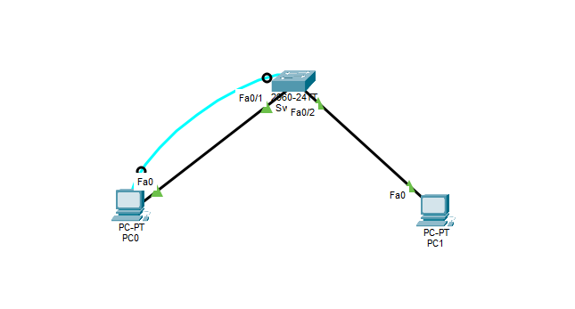
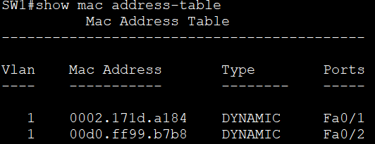

# Lab 1: Switch Fundamentals & L2 Operations (Switch Temelleri ve Katman 2 Operasyonları)

Cisco Packet Tracer üzerinde gerçekleştirdiğim temel ağ yapılandırma ve Katman 2 (L2) davranış analizi çalışması.

---

## 📌 Uygulama Özeti
Bu çalışmada Cisco 2960 Switch üzerinde temel L1/L2 ayarları yapılmış, konsol kablosu üzerinden CLI erişimi sağlanmış ve anahtarın (switch) cihazlara ait MAC adreslerini nasıl öğrendiği doğrulanmıştır.

## 🌐 Topoloji


## 🛠️ Yapılan İşlemler
- `PC-A` RS-232 portundan Switch Console portuna mavi konsol kablosu bağlanarak Terminal üzerinden CLI erişimi sağlandı.
- Switch cihaz adı `SW1` olarak değiştirildi.
- `Fa0/1` ve `Fa0/2` portlarının hızı `100 Mbps`, iletişim modu ise `full duplex` olarak sabitlendi.
- Yapılan konfigürasyon `write` (`wr`) komutu ile NVRAM belleğine kalıcı olarak kaydedildi.
- `PC-A` (`192.168.1.10`) cihazından `PC-B` (`192.168.1.20`) cihazına ping atılarak L2 trafiği başlatıldı.

## 📊 CLI Doğrulaması
Ping işlemi sonrasında `SW1` üzerinde `show mac address-table` komutu çalıştırıldı. `Fa0/1` ve `Fa0/2` portlarının karşısında cihazlara ait MAC adreslerinin dinamik olarak öğrenildiği teyit edildi.



------

# Lab 2: Cihaz Güvenliği ve Sertleştirme

Bu depo, **Lab 2** için yapılandırma dosyalarını, topoloji diyagramlarını ve güvenlik doğrulama kayıtlarını içerir. Bu laboratuvar, Cisco IOS switch'leri üzerinde temel cihaz güvenliği ve sertleştirme uygulamalarına odaklanmaktadır.

## 📌 Lab Objective (Lab Amacı)

Ağ altyapısının güvenli hâle getirilmesi, ilk savunma hattıdır. Bu laboratuvarın temel amaçları şunlardır:

* Ayrıcalıklı EXEC erişimini şifrelenmiş bir secret parolası ile güvence altına almak.
* Fiziksel konsol portu kimlik doğrulamasını uygulamak.
* Yapılandırma dosyasında saklanan tüm düz metin parolalarını şifrelemek.
* Caydırıcılık amacıyla yasal uyarı banner'ı (Banner MOTD) uygulamak.
* Yapılandırmaları kalıcı olarak NVRAM'e kaydetmek ve uygulamanın doğru şekilde gerçekleştirildiğini doğrulamak.

## 📐 Network Topology (Ağ Topolojisi)

* **Devices Used:** 1x Cisco 2960 Switch (`SW1`), 1x PC (`PC-A`)
* **Connection:** Console Cable (RS-232 to Console Port)
* **Topology File:** [`lab2.pkt](./lab2.pkt "null")

## 🛠️ Configuration Steps & Commands (Konfigürasyon Adımları)

### 1. Enable Secret (Ayrıcalıklı Mod Şifresi)

Ayrıcalıklı EXEC modunu kriptografik olarak güvenli bir hash ile korur.

```
SW1> enable
SW1# configure terminal
SW1(config)# enable secret cisco123

```

### 2. Console Port Authentication (Konsol Portu Güvenliği)

Fiziksel bağlantı isteklerinde erişim izni verilmeden önce kimlik doğrulaması yapılmasını sağlar.

```
SW1(config)# line console 0
SW1(config-line)# password cisco123
SW1(config-line)# login
SW1(config-line)# exit

```

### 3. Password Encryption (Şifre Kriptolama)

Çalışan yapılandırmadaki düz metin parolaları type-7 şifrelenmiş biçime dönüştürür.

```
SW1(config)# service password-encryption

```

### 4. Banner MOTD (Yasal Uyarı Mesajı)

Herhangi bir bağlantı girişiminde yasal uyarı mesajını görüntüler.

```
SW1(config)# banner motd # Unauthorized Access Prohibited! #
SW1(config)# end

```

### 5. Saving Configuration (Konfigürasyonu Kaydetme)

RAM'deki (`running-config`) değişiklikleri NVRAM'deki (`startup-config`) kalıcı yapılandırmaya aktarır.

```
SW1# write

```

## ✅ Verification & Testing (Doğrulama ve Test)

Yeniden başlatma işleminden veya oturumdan çıkıldıktan sonra konsol, sırasıyla banner mesajını, konsol parolasını ve enable secret parolasını ister.

*Cisco Network Lab Fundamentals Portfolio'nun bir parçası olarak oluşturulmuştur.*
